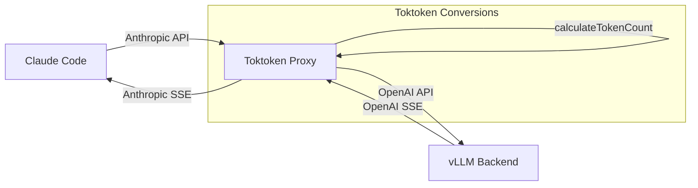

# Toktoken - Anthropic → OpenAI Proxy for vLLM

## Description

Lightweight proxy server allowing Anthropic clients (**Claude Code**) to communicate with **vLLM** backends via OpenAI API format. Converts Anthropic requests to OpenAI format, calls vLLM's `/v1/chat/completions` endpoint, and converts responses back to Anthropic format.

## Architecture



## Key Features

### 1. Protocol Conversion
- **Anthropic → OpenAI**: Converts messages, tools, system prompts
- **OpenAI → Anthropic**: Converts responses, tool_calls, stop reasons
- **SSE Streaming**: Real-time conversion of OpenAI SSE to Anthropic SSE

### 2. Token Counting
- Pre-calculates input tokens using `tiktoken` before streaming
- Injects accurate counts into Anthropic SSE events
- Fixes Claude Code's token display issues

### 3. Mistral/vLLM Compatibility
- **Tool ID Normalization**: Converts long IDs to 9-char Mistral format (FNV-1a hash)
- **Trailing Assistant Fix**: Appends "Continue." message when needed
- **Empty Message Filtering**: Removes invalid empty assistant messages

## vLLM Configuration

```yaml
args:
  - "--model"
  - "mistralai/Devstral-Small-2505"
  - "--tool-call-parser"
  - "mistral"
  - "--enable-auto-tool-choice"
  - "--chat-template-content-format"
  - "openai"
  - "--tensor-parallel-size"
  - "2"
```

## Configuration

```bash
PORT=3456
HOST=0.0.0.0
VLLM_URL=http://vllm.vllm.svc.cluster.local:8000
VLLM_API_KEY=********
LOG_LEVEL=info
```

## Running Tests

```bash
npm test
```
